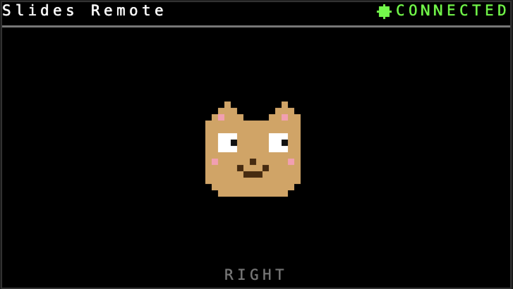

# Cardputer Presentation Remote



Turn an **M5Stack Cardputer** (or Cardputer ADV) into a Bluetooth remote for slide presentations (Google Slides, PowerPoint, Keynote, etc.).

The Cardputer advertises itself as a standard BLE HID keyboard and sends configurable key codes when you press the arrow keys on its physical keyboard.

## Hardware

- M5Stack Cardputer or Cardputer ADV (ESP32-S3)
- A micro-SD card (optional, for config customization)

## Key mapping

The four bottom-right keys of the Cardputer keyboard are used as arrows:

| Physical key | Default action |
|--------------|----------------|
| `,`          | Left arrow     |
| `.`          | Down arrow     |
| `;`          | Up arrow       |
| `/`          | Right arrow    |

## Build and flash

The project uses [PlatformIO](https://platformio.org/).

```bash
pio run                 # build
pio run -t upload       # flash over USB
```

A ready-to-flash merged binary (`firmware.bin`) is also produced at the project root by `scripts/merge_bin.py`.

If you don't want to install PlatformIO, download a prebuilt `.bin` from the [Releases page](https://github.com/blamouche/cardputer-presentation-remote/releases) (the file is named `presentation-remote-<VERSION>.bin`), then:

```bash
esptool.py --chip esp32s3 --port /dev/cu.usbmodem* write_flash 0x0 presentation-remote-<VERSION>.bin
```

The repo also contains a checked-in `cardputer-presentation-remote.bin` at its root as a convenience, but it is not updated automatically — prefer the Releases page for the latest version.

## SD-card configuration

On first boot, if an SD card is inserted, the firmware creates `/cardputer-presentation-remote.json` at its root with default values. Edit it to change the BLE device name, manufacturer, or key mapping.

Example (`sd/cardputer-presentation-remote.json`):

```json
{
  "device_name": "Slides Remote",
  "manufacturer": "M5Stack",
  "keys": {
    "left":  "LEFT_ARROW",
    "right": "RIGHT_ARROW",
    "up":    "UP_ARROW",
    "down":  "DOWN_ARROW"
  }
}
```

Accepted values for each key:
`LEFT_ARROW`, `RIGHT_ARROW`, `UP_ARROW`, `DOWN_ARROW`,
`PAGE_UP`, `PAGE_DOWN`, `HOME`, `END`,
`ESC`, `ENTER`, `TAB`, `SPACE`, `F5`,
or a single character (e.g. `"a"`, `"b"`).

Tip: for Google Slides in a browser, `PAGE_UP` / `PAGE_DOWN` are often more reliable than arrows.

The `Config:` field shown on screen indicates the load state:
- `loaded` — SD config read successfully
- `created` — no config found, default file written
- `no SD` — no SD card detected, defaults used
- `json err: ...` — invalid JSON

## Usage

1. Power on the Cardputer. The screen shows `BLE: WAITING`.
2. From the host OS, pair the "Slides Remote" in the Bluetooth settings. It must be recognized as a **keyboard**.
3. Once paired, the screen switches to `BLE: CONNECTED`.
4. Open your presentation, switch it to presentation mode, and click inside it to give it OS focus.
5. The four arrow keys on the Cardputer now flip through the slides. The `Last:` field shows the most recently sent key.

## Troubleshooting

**The Cardputer shows `CONNECTED` but key presses have no effect on the target.**

Common causes:
- Pairing completed, but not as an HID keyboard. Forget the device in your OS Bluetooth settings and re-pair.
- The target window doesn't have OS focus. Click into it before pressing keys.
- Some web apps intercept arrow keys differently — try `PAGE_UP` / `PAGE_DOWN` in the config.

**The `Last:` field doesn't change when I press keys.**

The Cardputer isn't registering the presses. Make sure you're pressing `,` `.` `;` `/` (the bottom-right cluster of the keyboard).

## BLE stack

The project uses the NimBLE fork [`wakwak-koba/ESP32-NimBLE-Keyboard`](https://github.com/wakwak-koba/ESP32-NimBLE-Keyboard). The original T-vK fork (Bluedroid) doesn't finalize HID pairing correctly with recent arduino-esp32 versions on ESP32-S3 — the connection is established but the host ignores every keyboard report.

At the time of writing, the NimBLE fork's `BleKeyboard.h` is missing `#include <functional>`. If compilation fails with `'std::function' does not name a template type`, add that include manually at the top of `.pio/libdeps/cardputer-adv/ESP32 BLE Keyboard/src/BleKeyboard.h`. The CI workflow (`.github/workflows/release.yml`) applies this patch automatically.

## Releases

Prebuilt binaries are published on the [Releases page](https://github.com/blamouche/cardputer-presentation-remote/releases). Each release ships a single asset, `presentation-remote-<TAG>.bin`, ready to flash with `esptool.py` (see [Build and flash](#build-and-flash)).

Pushing a tag triggers the release workflow which builds the firmware and publishes a GitHub release with `presentation-remote-<TAG>.bin` attached:

```bash
git tag v1.0
git push --tags
```

## Project structure

```
├── platformio.ini                          # PlatformIO config + lib_deps
├── src/main.cpp                            # firmware source
├── scripts/merge_bin.py                    # merges bootloader+partitions+app into a single .bin
├── sd/cardputer-presentation-remote.json   # sample config to drop on the SD card
├── .github/workflows/release.yml           # tag-triggered build + GitHub release
└── cardputer-presentation-remote.bin       # prebuilt ready-to-flash binary
```
